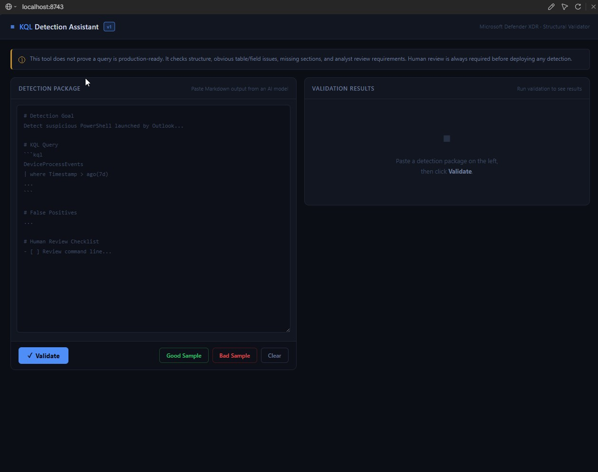
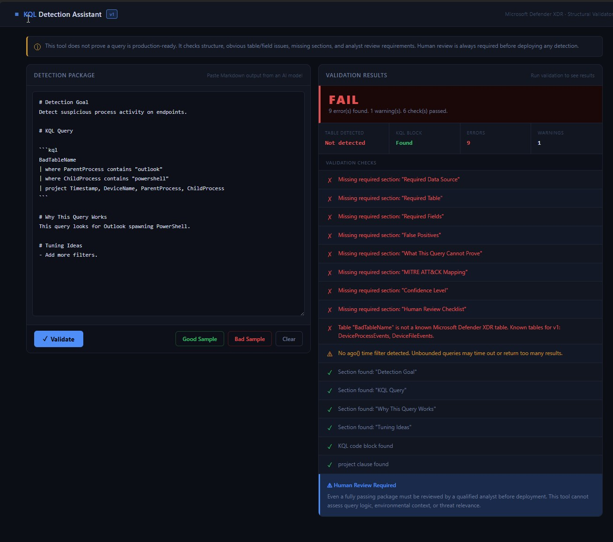
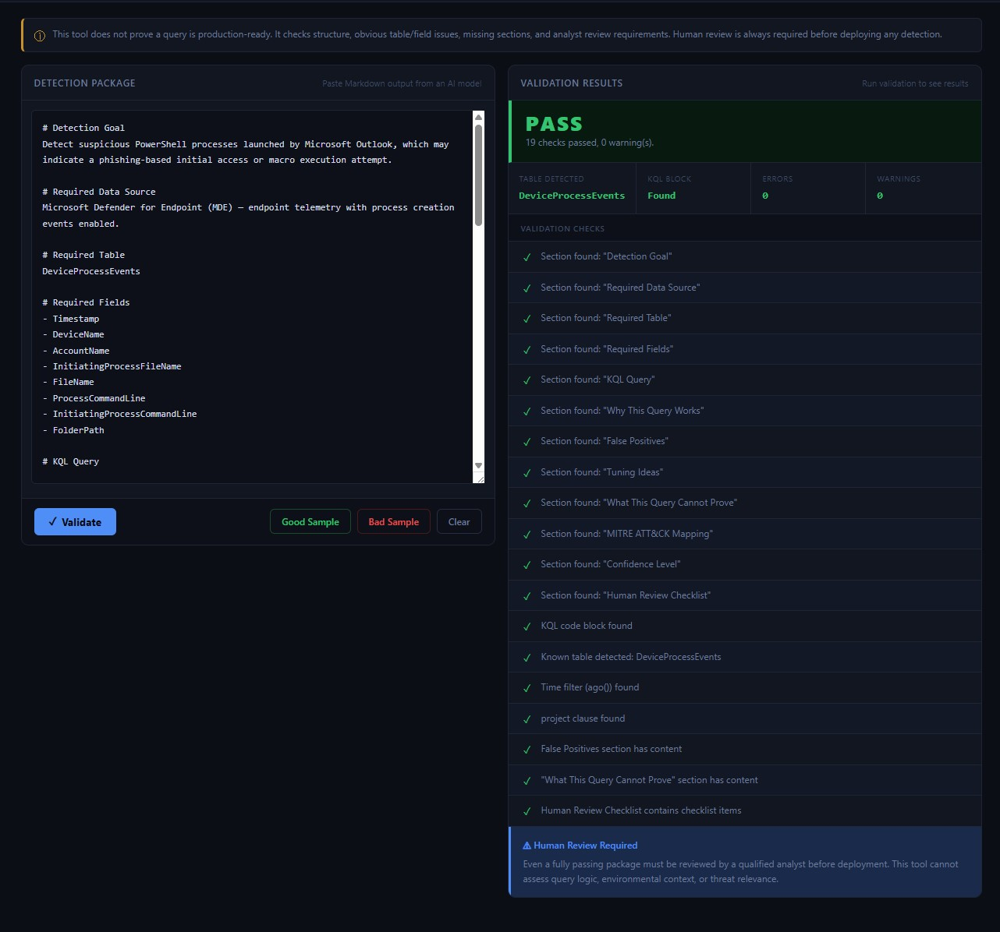

# KQL Detection Assistant

A static, browser-based **structural validator** for AI-generated Microsoft Defender XDR detection packages.

> KQL Detection Assistant is a static browser-based validator for AI-generated Microsoft Defender XDR detection packages. It demonstrates a safer AI-assisted detection workflow: AI can draft, deterministic checks can validate structure, and human analysts remain responsible for final review.

---

## Project Summary

When an AI model drafts a KQL detection, the output often *looks* correct but hides structural gaps — a missing time filter, a non-existent field, an empty "False Positives" section, or no analyst review checklist. These gaps are easy to miss in a quick read and costly to discover after deployment.

This tool runs a set of **deterministic checks** against a pasted detection package and reports a clear **PASS** or **FAIL**, along with specific errors and warnings. It runs entirely in the browser — no backend, no database, no AI API calls, no data leaving the page.

It is a **pre-filter for human review**, not a replacement for it.

## Screenshots

### Initial state

The validator starts with a clean input panel and an empty validation result panel.



### Bad Sample — FAIL

The bad sample fails validation because it is missing required sections, uses an unknown table, and lacks a time filter.



### Good Sample — PASS

The good sample passes validation with 0 errors and 0 warnings.



---

## Screenshots

> _Add screenshots here before publishing._

| View | Image |
|---|---|
| Good sample — PASS | `` |
| Bad sample — FAIL | `` |

_(Replace the placeholders above with real images once captured. Suggested location: `docs/`.)_

---

## Why I Built This

AI-generated KQL detections fail in predictable, repeatable ways:

- They reference fields that don't exist in the target table (e.g. `ParentProcess`, `ChildProcess`).
- They skip the `ago()` time filter, producing unbounded queries.
- They produce a "False Positives" heading with no actual content underneath.
- They omit the "What This Query Cannot Prove" section entirely.
- They never include a human review checklist.

I wanted to demonstrate a **safer AI-assisted detection workflow**: let AI draft the package, let deterministic checks catch the obvious structural problems instantly, and keep a human analyst responsible for the final decision. A fast structural gate before review saves analyst time and reduces the chance of shipping a broken or misleading detection.

---

## How It Works

1. The analyst pastes an AI-generated detection package (Markdown) into the text area.
2. On **Validate**, vanilla JavaScript parses the Markdown and runs a series of checks:
   - It scans for required Markdown headings.
   - It extracts the first fenced KQL code block.
   - It reads the content **under each heading up to the next heading** to confirm sections are actually filled in.
   - It inspects the KQL text for a known table, a time filter, a `project` clause, and known-invalid fields.
3. The result is rendered as a PASS/FAIL verdict, summary cards, and a colour-coded check list (errors in red, warnings in yellow, passed checks in green).

> The tool performs **string and structure inspection only**. It does **not** parse, compile, or execute KQL, and it cannot connect to any data source.

---

## How to Run Locally

This is a fully static site. From inside the `kql-detection-assistant/` folder:

```bash
python -m http.server 8743
```

Then open:

```
http://localhost:8743
```

A local server is recommended because the **Load Good Sample** / **Load Bad Sample** buttons use `fetch()` to read the files in `examples/`, which some browsers block on the `file://` protocol. Pasting and validating works without a server.

---

## Validation Checks

| Check | Type | Severity |
|---|---|---|
| All 12 required Markdown sections are present | Structural | Error |
| A fenced KQL code block exists | Structural | Error |
| The query uses a known Defender XDR table | Schema | Error |
| The query includes an `ago()` time filter | Quality | Warning |
| The query includes a `project` clause | Quality | Warning |
| "False Positives" section has meaningful content | Quality | Warning |
| "What This Query Cannot Prove" has content | Quality | Warning |
| "Human Review Checklist" contains checkbox items (`[ ]` / `[x]`) | Review | Warning |
| No known-invalid fields used for the detected table | Schema | Warning |

**Required sections (v1):**
Detection Goal · Required Data Source · Required Table · Required Fields · KQL Query · Why This Query Works · False Positives · Tuning Ideas · What This Query Cannot Prove · MITRE ATT&CK Mapping · Confidence Level · Human Review Checklist

**Known tables (v1):**
`DeviceProcessEvents` · `DeviceFileEvents`

---

## Example Results

Two sample packages are included in `examples/` to demonstrate both outcomes.

**Good sample** (`sample_good_output.md`) — a well-formed PowerShell-from-Outlook detection:

```
PASS
0 errors
0 warnings
```

**Bad sample** (`sample_bad_output.md`) — wrong table, no time filter, invalid fields, missing sections:

```
FAIL
9 errors
1 warning
```

---

## Limitations

This tool checks **structure, obvious table/field issues, missing sections, and analyst review requirements**. It does not do more than that. Specifically, it does **not**:

- **Execute or parse KQL.** A syntactically broken query can still pass structural checks.
- **Validate query logic.** It cannot tell whether the detection logic is correct or effective.
- **Assess environmental fit.** It cannot know whether your environment produces the required telemetry.
- **Judge threat relevance.** It cannot determine whether the detection addresses a real risk in your context.
- **Predict false-positive rates.** It cannot estimate how noisy a detection will be.
- **Cover the full schema.** Only a small subset of Defender XDR tables and fields is included in v1.

A passing result means the package is **structurally complete** — nothing more.

---

## Future Improvements

Ideas for later versions (not implemented in v1):

- Add more known tables and fuller field schemas.
- Add lightweight KQL syntax linting.
- Add optional AI-assisted logic review as a clearly-labelled, human-supervised step.
- Add export to JSON or PDF for documentation workflows.
- Add detection package templates for common attack techniques.

---

## Human Review Required

Structural validity is a floor, not a ceiling. A detection package that passes every check here can still:

- Miss the actual attacker behaviour it claims to detect.
- Generate large volumes of false positives in a real environment.
- Fail silently because the required telemetry is not collected on your devices.
- Use logic that looks correct but is subtly wrong for your configuration.

**This tool does not prove a detection is production-ready, does not execute KQL, and does not replace detection engineers.** A qualified analyst with knowledge of your environment must review and test every detection before it goes to production. Human review remains a required step in the workflow.

---

## Project Structure

```
kql-detection-assistant/
├── index.html               Main application
├── style.css                Dark SOC theme
├── app.js                   Validation logic (vanilla JS)
├── README.md                This file
├── examples/
│   ├── sample_good_output.md    Passing example
│   └── sample_bad_output.md     Failing example
└── docs/
    └── project-notes.md     Design decisions, limitations, v2 ideas
```

---

## Tech Stack

Plain **HTML + CSS + vanilla JavaScript**. No framework, no build step, no dependencies, no backend. Open `index.html` (via a local server) and it works.
